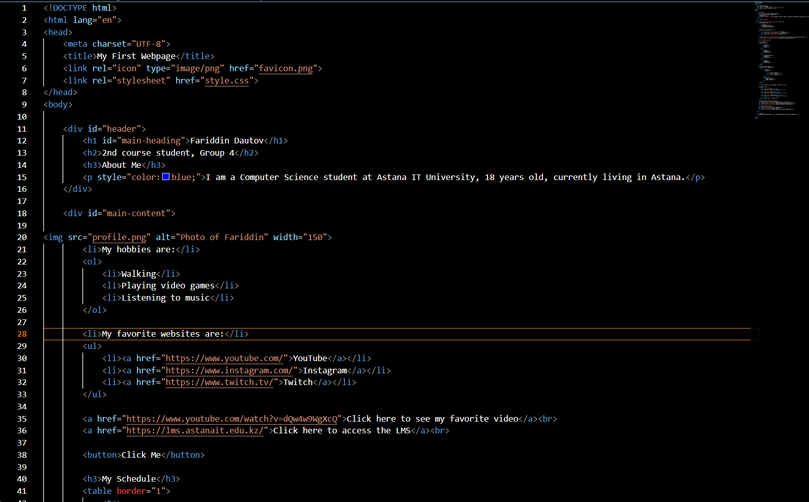
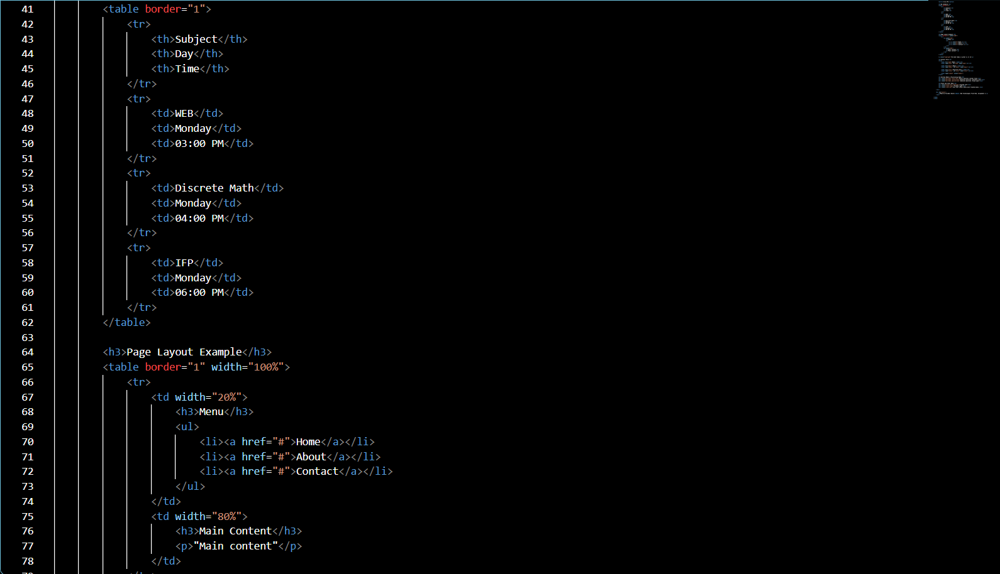
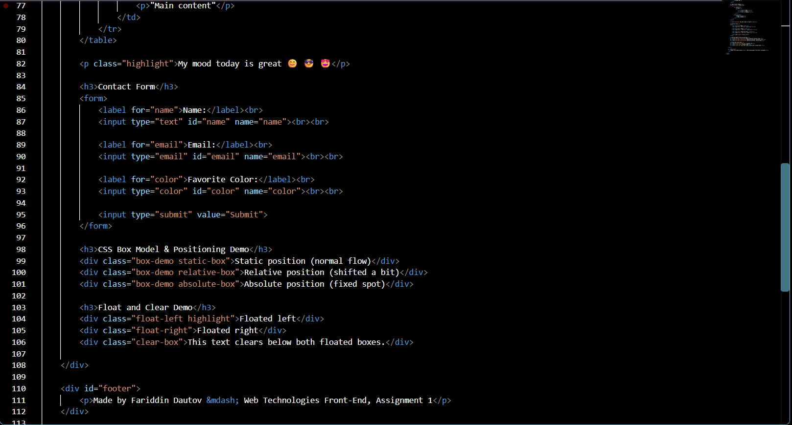
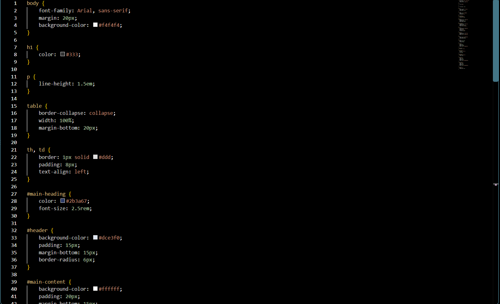
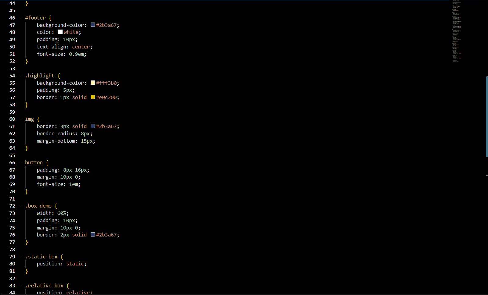
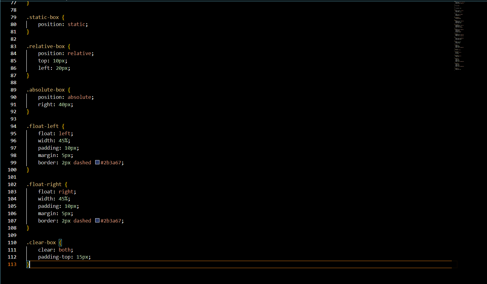

# Assignment 1 — Front-End (HTML & CSS)

**Name:** Fariddin Dautov
**Group:** 4

## Objective

Build a personal webpage that demonstrates core HTML structure and CSS styling: text formatting, lists, images, links, tables, forms, and progressively more advanced CSS (inline, internal, external, selectors, box model, positioning, sizing units, float/clear).

## Part 1 — Introduction to HTML

- Created `assignment1WEB.html` with the standard boilerplate and page title "My First Webpage".
- Structured the top of the page with `<h1>`–`<h3>` for my name, course, and an "About Me" heading, followed by a short paragraph (styled with inline CSS).
- Added my photo with ``, an ordered list of my hobbies, and an unordered list of my favorite websites with clickable links.
- Added a plain "Click Me" button.

## Part 2 — Intermediate HTML

- Built a 3-column table (Subject / Day / Time) for my weekly schedule.
- Built a second table used purely for a two-column menu/content layout.

- Added a paragraph with 3 emojis describing my mood, styled with the `.highlight` class.
- Added a form with Name, Email, and Favorite Color inputs plus a Submit button.
- Added the box model / positioning demo boxes and the float / clear demo boxes.

## Part 3 — Introduction to CSS

- Used inline CSS on the About Me paragraph (`style="color:blue;"`).
- Moved all styling into an external `style.css` file linked from `<head>`.
- Used element selectors (`body`, `h1`, `p`, `table`, `th`, `td`), an ID selector (`#main-heading`), and section IDs (`#header`, `#main-content`, `#footer`) for layout.

## Part 4 — Intermediate CSS

- Added a favicon with `<link rel="icon">`.
- Grouped the page into `#header`, `#main-content`, and `#footer` divs, each with its own background color and padding.
- Added a `.highlight` class (reused on the mood paragraph and a floated box), styled `img` and `button` elements, and set up the `.box-demo` base style for the positioning demo.

- Demonstrated `position: static`, `relative`, and `absolute` on three separate boxes.
- Added a float/clear demo with two boxes floated left and right, cleared by the element below them.
- Used a mix of sizing units across the stylesheet — `px` for borders/padding/margins, `%` for widths, `em`/`rem` for text sizing.

## Summary

Working through this assignment, I started from a basic static page and layered on structure and styling step by step — first getting the raw HTML content right, then separating style from content by moving everything into `style.css`, and finally practicing the trickier CSS concepts (positioning and floats) with small dedicated demo boxes so it's clear which rule does what. The biggest thing I had to be careful about was CSS specificity — since I used both ID and class selectors, I made sure they didn't fight each other on the same elements.

## Files

- `assignment1WEB.html` — the webpage
- `style.css` — external stylesheet
- `profile.png` — profile photo
- `favicon.png` — site favicon
- `screenshots/` — code screenshots referenced above

file:///C:/Users/dauto/Assignment1WEB-1/assignment1WEB.html
